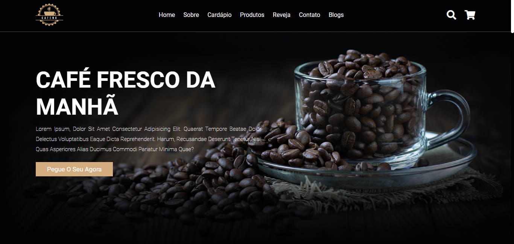

<h1>Site Responsivo</h1>

Desenvolvi esse site, para treinar o uso de CSS puro, sem frameworks, acompanhando um tutorial de web design

<h2>Tecnologias utilizadas:</h2>
<ul>
    <li>HTML</li>
    <li>CSS / Sass</li>
    <li>Javascript</li>
</ul>

    
        

            
            
        

